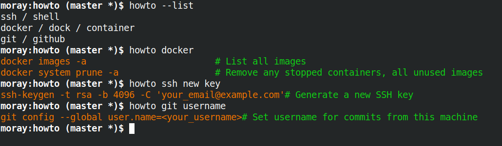

# howto

A simple script to display common uses of a command when you cannot quite remember 
that special incantation.



## Installation

This will install a script howto into a directory $HOME/bin directory and the helpfiles and config file will
be put into $HOME/.config/howto.  This is so that you don't need root permissions.

```
pip3 install --user colorama
git clone https://www.tom-mccallum.com/howto
cd howto
./install.sh
```

It will also add the following to your .bashrc

```
export PATH=$HOME/bin:$PATH
```

## Usage

```
howto docker username
howto ssh new key
```

The program is ```howto```, the first argument matches the tool (name and synonym fields in the helpfile) and the following words are used to narrow the search by searching the description.

To show all tools available:

```
howto --list
```

## To add new helpfiles

Help files are JSON files.  Copy one of the existing ones and add your own commands to it.  All helpfiles can be found in the directory ```$HOME/.config/howto/helpfiles```.

Here is an example from docker.json.
```
{
    "name": "docker",
    "synonyms": [ "dock", "container" ],
    "commands":[
        {
            "command": "docker images -a",
            "description": "List all images"
        },
        {
            "command": "docker system prune -a",
            "description": "Remove any stopped containers, all unused images"
        }
    ]
}
```